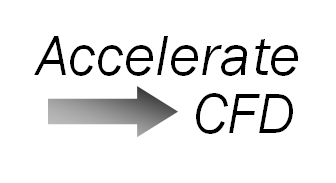
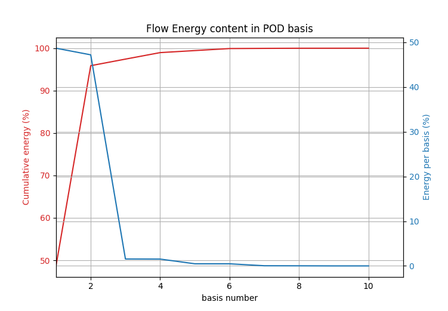

# AccelerateCFD #

**Welcome to AccelerateCFD**

This is a community edition of Illinois Rocstar LLC's **AccelerateCFD**. This guide contains information about all the modules of this software as well as talks about installation and other platform requirements. A tutorial is also included with this guide.

AccelerateCFD uses **Proper Orthogonal Decomposition (POD)** principle to reduce the full order CFD flow into a reduced order model which runs several magnitudes faster and reconstructs the flow fields.

AccelerateCFD_Community_Edition is provided under GNU General Public License version 3. For
more info, please see the **LICENSE** file. OpenFOAM is Copyright (C) 2011-2017 OpenFOAM Foundation. Eigen 3.3.7 is included in podBasisCalc and podPrecompute utility folders. User does not need to build or install that as it is a header only library.

## Version ##

Version 0.3.0 (View *[CHANGELOG](https://github.com/IllinoisRocstar/AccelerateCFD_CE/blob/master/CHANGELOG)* Here.)

AccelerateCFD_Community_Edition follows semantic versioning. The versions will be major.minor.patch. We will:

* Increase the patch version for bug fixes, security fixes, and code documentation. Backwards compatible; no breaking changes.
* Increase the minor version for new features and additions to the library’s interface. Backwards compatible; no breaking changes.
* Increase the major version for breaking changes to the library’s interface or breaking changes to behavior.

## Modules ##

There are five modules to this software. 

  **podBasisCalc**
  * This application calculates POD basis for velocities in CFD case directory and gives
    information about flow energy contained in each POD basis. It solves eigen value problem to identify most important flow characteristics from the flow.
  
  **podPrecompute**
  * This application calculates gradient and tensor terms as well as some tensor innerproducts
    for velocity and POD basis vectors. All the pre-computed data which is essential for computing the reduced order model (ROM) is written in the case directory. The file "prevVals.csv" contains time varying coefficients obtained using proper orthogonal decomposition.
  
  **podROM**
  * This application uses all the data written out from **podPrecompute** application and   
    calculates the time varying coefficients for spatial POD basis to construct reduced order model. It writes values of time varying coefficients in the case directory which are used for reconstructing the velocity field.

  **podReconstruct**
  * This application reads in the values of time varying coefficients and reconstructs
    velocities. These reconstructed velocties are automatically written into their respective time directories of CFD case for ease of visualization.

  **podPostProcess**
  * This application allows users to obtain additional information from reduced order as well as full order models for comparison and reference purposes. Right now this utility supports calculation of time varying coefficients from full order model that can serve as a reference to reduced order time coefficients calculated using podROM utility. This utility operates based on command line arguments. All available arguments are explained later in this guide.

## Platform Requirements ##

AccelerateCFD works on Linux plateform with following installed:

  * OpenFOAM v4.0 and higher
  * CMake
  * A C++11-standard-compliant compiler
  * Paraview or similar visualization software (optional)
  * AccelerateCFD_Community_Edition has been tested on Ubuntu 16.04 and 18.04 with OpenFOAM v4.0, OpenFOAM v5.0, OpenFOAM v6.0, OpenFOAM v7.0, and OpenFOAM v2006.
  
  
## Installation & Getting Started ##

Clone or download all the folders anywhere in your computer (i.e /home/Community_AccelerateCFD/). To clone AccelerateCFD_Community_Edition, use following command.

    $ git clone https://github.com/IllinoisRocstar/AccelerateCFD_CE.git

If you download the tab.gz file, extract it first. Open the terminal and navigate to the software directory.

First step is to compile the modules. Follow the procedure below.

    $ ACFD_Source_Path=/full/path/to/AccelerateCFD
    $ cd ${ACFD_Source_Path}
    $ mkdir build && cd build
    $ cmake ..
    $ make -j($nproc) && make install

This will install all utilities.
  
User needs podDict and podROM into case folder at their respective locations mentioned above.

## Running Test Case Example ##

Once you have successfully completed all steps mentioned above in installation and getting
started, let's run an example case with AccelerateCFD software. This case is a flow over cylinder example at Reynolds number = 100. The case is already set up with mesh file and other parameters.

Navigate to the case directory and run blockMesh utility to build the mesh.

    $ cd ${ACFD_Source_Path}/SampleCase
    $ blockMesh

If user wants run the case in parallel, please edit system/decomposeParDict for "numberOfSubdomains" equal to number of processors. Type the following commands to decompose the mesh and run the case..

    $ decomposePar
    $ mpirun -np <number of processors> pisoFoam -parallel

Once the parallel run in finished, user does not need to reconstruct the case as AccelerateCFD utilities works on decomposed case in parallel.

If user wants to run the case using just one processor, run the case using "pisoFoam" command.

    $ pisoFoam

After the serial/parallel calculations are over, user can go ahead and calculate the basis. Run **podBasisCalc** to calculate basis vectors. This will store all the basis vectors in last time directory of case. podBasisCalc utility provides users with an option to specify number of basis to write in last time directory (i.e for writing basis up to 50, use podBasisCalc 50). If user want to write all the basis in last time step folder, use 0 (i.e podBasisCalc 0). Another optional argument with podBasisCalc provides users with ability to define custom time range for snapshots selection using -time argument. This argument is also available with podPrecompute and podFlowReconstuct. 
    
    $ podBasisCalc <number of basis to write> -time <start>:<end>

To run podBasisCalc in parallel

    $ mpirun -np <number of processors> podBasisCalc <number of basis to write> -time <start>:<end> -parallel
  
Let the process finish and you will see that last time directory has several basis written as sigma_0, sigma_1, etc... Now, if you notice in the main case directory, there will be a CSV file named "podEnergy.csv". Open the file and you will see that for this case, only first 5-6 POD bases vectors has cummulative energy of above 99%. This suggests that any basis vectors after that contains very small length scales (Try visualizing them in paraView). This can be used to decide number of POD basis to use to run reduced order model. A utility **plotPOD.py** is included to help users visualize energy content of POD modes.

For this case, using this utility provides following plot. This plot reinforces selection of 5 or 6 POD bases for current ROM.

Navigate to the constant folder of CFD case directory open podDict to edit.
  
    $ cd constant/
    $ gedit podDict
  
**podDict** is a way of interacting with AccelerateCFD. You can give these 5 predefined inputs by changing them here. These inputs will be different for each case.
* The value of **nu** must be same as value of nu in **transportProperties** file located in constant/ directory of case.
* **nDim** is total number of POD basis to use for ROM. This can be decided by flow energy plots shown above.
* User can change the time step but sometimes it can lead to floating point error as reduced order model is very sensitive to timestep **dt** and number of POD basis used for calculations.
* Term **artificial_nu** is artificial viscosity term that helps reducing the decay in velocity dynamics after few seconds of reduced order model runtime. Change this term according to the non-linearity of CFD case. Positive value will add and negative value will substract to the viscosity  
* Keep last 2 values (writeFreq, and tEnd) as default unless you have made changes to the time loop in any of the applications and you know what you are doing. Otherwise, all the applications will figure out your case timestep and case runtime automatically.

After saving and closing podDict file, let's pre-computed some data. User needs to make sure that if the optional **-time** argument was used during calculation of basis, it needs to be used for podPrecompute and podFlowReconstruct as well.
  
    $ cd ..
    $ podPrecompute -time <start>:<end>

To run podPrecompute in parallel,

    $ mpirun -np <number of processors> podPrecompute -time <start>:<end> -parallel

This will generate bunch of CSV files in case directory. DO NOT CHANGE ANYTHING IN THOSE FILES. To calculate the time varying coefficients, run podROM as per below. Note that podROM utility runs on single processor. Additionally user can define one optional argument with this program to use certain number of basis for computation of time varying coefficients instead of number of basis specified in podDict. This allows users to test stability of their ROM with various number of basis. Note that maximum number for this argument must not be more than number of basis specified in podDict file.
  
    $ ./podROM <# of basis>
  
Once the process completes, you will see an additional CSV file which contains values of time varying coefficients of ROM. Finally, as we have POD basis and time varying coefficients, we are ready to reconstruct velocity fields.
  
    $ podFlowReconstruct -time <start>:<end>

To run podFlowReconstruct in parallel,

    $ mpirun -np <number of processors> podFlowReconstruct -time <start>:<end> -parallel
  
Now every time directory in CFD case has a new vector file named "Urom".
This is the reconstructed velocity. If you have noticed, the calculations done by "podPrecompute" , "podROM", and "podReconstruct" took much less time than full LES CFD calculation would have taken. Compare both full order **(U)** and reconstructed **(Urom)** velocities in Paraview.

AccelerateCFD has a post process utility which allows users to get some additional information such as full order time coefficients to compare against reduced order model time coefficients calculated using podROM utility. We will keep adding additional post processing functionality as needed and as requested by our user community.

To initiate calculation of full order time varying coefficients (here called as "aPOD"), user needs to run following command. This will output "aPOD.csv" file.

    $ podPostProcess get_aPOD

For parallel run,

    $ mpirun -np <number of processors> podPostProcess get_aPOD -parallel

## Contact/Feedback/Issues ##

* For any issues, please open a new issue here and the developer team will help you resolve it.
* For feedback/contact purpose, please visit www.illinoisrocstar.com/about/contact 
* You may also email the project lead at twilson@illinoisrocstar.com

